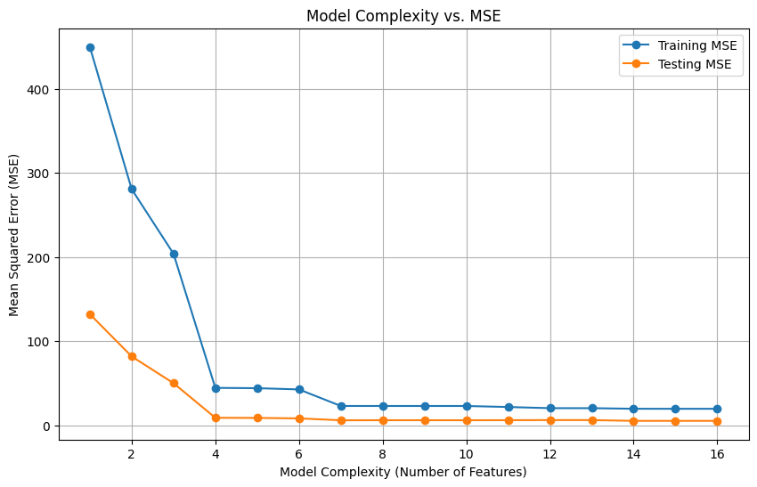

## CSE151A-Project-Repo
Machine Learning Project in Python

## Jupyter Notebook

## Preprocessing Plan Milestones 1-2
We plan on viewing our data and looking at any categorical values and one hot encoding them. We see that there is a star color and a spectral class, so we will one hot encode those. They are categorical data that are nominal and we do not want to have one to be greater than the other. We will then use min max scaling to normalize each field of the input data. 

## Data Preprocessing Milestone 3 Answers
4. **Where does your model fit in the fitting graph.**
   The model appears to fit in the ideal range in the fitting graph. With the MSEs, the model seems to be making the correct predictions and not overfitting or underfitting. The test data MSE is just above the training data. 

5. **What are the next 2 models you are thinking of and why?**
We are thinking of doing logistic regression and a neural network. We think that logistic regression is better for classification of multiple classes, and that neural networks would be more accurate and can predict more types.

7. **Conclusion section: What is the conclusion of your 1st model? What can be done to possibly improve it?**
Our 1st model concludes that linear regression does not look like a good fit for the data, because this is a classification problem. The MSE only indicates the continuous values, rather than the probability of what star type it may be. To improve it, models like logistic regression and a neural network may need to be used. These models are better suited for classification problems than linear regression is. If we strictly wanted to improve the linear regression model, we would need to collect more data and select better correlated features.

## Model 2: Milestone 4 Answers
1. **Evaluate your data, labels and loss function. Were they sufficient or did you have have to change them.**

      We one-hot encoded our y_test and y_train for the Star Types so we can use 6 node output layers with the activation function “sigmoid”. We had to change our loss function to categorical cross_entropy because our output is not continuous which is what MSE is good for. Since we are categorizing, we use the categorical loss function. We chose the learning rate of 0.1

3. **Evaluate your model compare training vs test error**

    Training Accuracy: 0.94
    Testing Accuracy: 0.88

4. **Where does your model fit in the fitting graph, how does it compare to your first model?**

    Testing Accuracy is slightly lower than Training Accuracy, no overfitting, the model is in the ideal range of the fitting graph. 
    Compare to the first model, neural network perform a bit better than linear regression

5. **Did you perform hyper parameter tuning? K-fold Cross validation? Feature expansion? What were the results?**

    We did a dry neural network with 100 epochs. The results showed that our model validation data accuracy improved and our model’s loss decreased with more epochs. The testing accuracy was just a little bit worse than the testing accuracy. 

    We also did hyper parameter tuning and we found that one of the best learning rate was 0.2, with 2 hidden layers with 8 nodes inside them. This led to the highest validation accuracy of 1.0 

5. **What is the plan for the next model you are thinking of and why?**

    We were thinking of doing Naive Bayesian Classifier because it is also a solid choice for categorizing multi-class data. This algorithm works very fast and is expected to easily predict the class of a test dataset.

7. **Conclusion section: What is the conclusion of your 2nd model? What can be done to possibly improve it? How did it perform to your first and why?**

    We conclude that using a neural network to classify the Star Types is significantly more efficient and accurate than using linear regression. It seems to improve better with more model complexity (epochs) and has solid results when distinguishing between the 6 classes of star types. It performed better than our first model because we had less problems setting it up. We had to manipulate the data a bit more to work with linear regression and finding the error required some manual work. Using the neural network was more straightforward and easy to debug if we ran into any issues/errors. 

**Insights / Model 2 Setup Process:**
    We ran into trouble as our data did not sufficiently predict the Star Type of 0 and 5 enough for the model to predict any samples for it, with the node units being 16, 8, 4, and then 6 respectively.
    We fixed this problem by making our hidden layers 16 nodes, which fixed that problem as well as increasing the validation accuracy. 
## Our Contributors :

 
 
