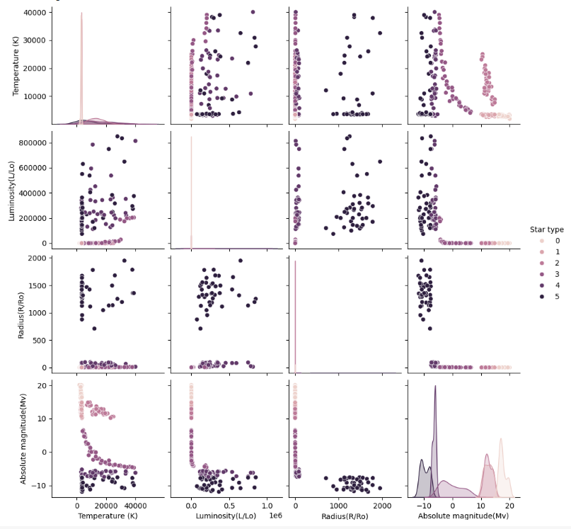

# CSE151A Project Report
Machine Learning Project in Python

## Jupyter Notebook
<a target="_blank" href="https://colab.research.google.com/github/kaijia2022/CSE151A-Project-Repo/blob/main/StarType_Prediction.ipynb">
  
</a>

## Introduction 

In this study, we leverage a comprehensive astronomical dataset, originally curated to encapsulate a wide array of celestial phenomena, to address a novel research question: predicting asteroid types based on a variety of celestial features. The dataset, which has been cleaned up and made available on Kaggle, includes detailed observations on stellar attributes such as temperature, luminosity, radius, absolute magnitude, spectral class, and color. These features are utilized to construct a predictive model for asteroid classification. The primary objective of this research is to establish a predictive model using a Neural Network and Naive Bayes model that can accurately classify asteroids into predefined categories, utilizing the stellar attributes outlined in the dataset. We choose to use this dataset as we all had an interest in astronomy and as such wanted to choose a project that related to it. We eventually settled on predicting star types as we thought it would be interesting to know more about the types of stars. 

Dataset Description: The dataset has 7 columns; 
* Temperature (K) (numerical) - Represents the temperature of the star, which is measured in Kelvin (K).
* Luminosity (L/Lo) (numerical) - The total amount of energy that is emmitted by the star over a given time frame, relative to the luminosity of the sun (Lo). Radius (R/Ro) (numerical) - The measure of the radius of the star relative to the radius of the sun (Ro).
* Absolute Magnitude (Mv) (numerical) - The measure of the brightness of star from a set point in the universe (i.e. Measuring the brightness of stars from Earth).
* Star Type (numerical) - Contains 6 star types, brown type, red dwarf, white dwarf, main sequence, supergiants, hypergiants; which are then represented by a numerical value.
* Star Color (categorical) - Specifies the color of the star.
* Spectral Class (categorical) - Classification system based on the characteristics of a star's spectrum, including its temperature and composition. These 7 features are the information of an asteroid, which are very comprehensive and provide most of the details of the asteroid.

## Method

### Data Exploration
* Summary / Described data: 


* Correlation table:


* Figures: 


### Preprocessing

1. We looked for categorical values and one hot encoded them using `pd.get_dummies`. We one hot encoded the star color and spectral class and dropped them from the dataframe temporarily. 

2. We then used min max scaling to normalize each numerical field of the input data using `scaler = MinMaxScaler()` and `scaler.fit_transform(features)`. This was the Temperature, Luminosity, Radius, and Absolute Magnitude. 

3. Finally, we concatenated the normalized data with the one hot encoded features and stored it as our final dataframe via `processd_df = pd.concat([normal, oneHot_color, oneHot_class, df['Star type']], axis=1)`

* Final Preprocessed Data:


___
### Initial Steps: 
We split our data into test and training data. 
```
from sklearn.model_selection import train_test_split

X = processd_df.drop(['Star type'], axis=1)
y = processd_df['Star type']

X_train, X_test, y_train, y_test = train_test_split(X, y, test_size=0.2, random_state=42)
```
___
### Model 1: Linear Regression

1. We initialized a linear regression model and fitted our training data
```
linear_model = LinearRegression()
linear_model.fit(X_train, y_train)
```

2. We used the model to then predict for our X_train and X_test values. 
```
yhat_train = linear_model.predict(X_train)
yhat_test = linear_model.predict(X_test)
```

3. We manually calculated the MSE of the predicted valuees from the actual values using the formula $ (1/n)\sum(\hat y - y)^2  $
```
y_train_error = ((yhat_train - np.array(y_train))**2).sum()
y_test_error = ((yhat_test - np.array(y_test))**2).sum()
```

4. We wanted to see the weights of each feature on the predictions, so we put it on a scatterplot. 
```
sns.scatterplot(x = list(range(0, len(linear_model.coef_))), y = linear_model.coef_)
``` 

5. Finally, we put all of the above into a for loop that added a new feature per iteration to see how adding more model complexity affected our linear model's MSE. 

___
### Model 2: Neural Network
1. We initialize our neural network with two hidden layers

```
classifier = Sequential()
classifier.add(Dense(16, activation = "relu", input_dim = 16))
classifier.add(Dense(16, activation = "relu"))
classifier.add(Dense(16, activation = "relu"))
classifier.add(Dense(6, activation = "sigmoid"))
```
2. We compiled our model with 0.1 learning and fit to our training set.
```
sgd_optimizer = SGD(learning_rate=0.1)

classifier.compile(optimizer = sgd_optimizer, loss = "categorical_crossentropy", metrics=["accuracy"])

history = classifier.fit(X_train, y_train_onehot, validation_split=0.2, epochs = 100, batch_size = 50, verbose = 1)
```
3. We then used the model to predict for our X_train and X_test value and used the classification report to check our model's accuracy.
```
yhat = classifier.predict(X_train)
y_pred = np.argmax(yhat, axis=1)
y_true = np.argmax(y_train_onehot.values, axis=1)
print(f"Trainning Report: {classification_report(y_true, y_pred)}")

yhat = classifier.predict(X_test)
y_pred = np.argmax(yhat, axis=1)
y_true = np.argmax(y_test_onehot.values, axis=1)
print(f"Testing Report: {classification_report(y_true, y_pred)}")
```

4. We used hyper parameter tuning to optimize our model
```
def buildHPmodel(hp):
  model= Sequential()
  #input layer
  model.add(Dense(16, activation = 'relu', input_dim = 16))
  # hidden layer
  model.add(Dense(units=hp.Int(f'units_layer 1', min_value=8, max_value=16, step=4),activation='relu'))
  model.add(Dense(units=hp.Int(f'units_layer 2', min_value=8, max_value=16, step=4),activation='relu'))
  # output layer
  model.add(Dense(6, activation = 'sigmoid'))
  learning_rate = hp.Choice('learning_rate', values=[0.1, 0.2, 0.3])

  model.compile(optimizer=SGD(learning_rate=learning_rate), loss='categorical_crossentropy', metrics=['accuracy'])
  return model

hp = keras_tuner.HyperParameters()
tuner = keras_tuner.GridSearch(
    hypermodel=buildHPmodel,
    objective="val_accuracy",
    max_trials=27,
    executions_per_trial=1,
    max_consecutive_failed_trials=3,
    project_name='Star_type_prediction1'
)

# To break the tuning when there is no imporvement, in order to find out the best epochs
early_stopping = EarlyStopping(
    monitor='val_accuracy',
    patience=10,
    restore_best_weights=True
)

tuner.search_space_summary()
tuner.search(X_train, y_train_onehot, epochs=100, validation_split=0.2, callbacks=[early_stopping])
```

___
### Model 3: Naive Bayes
We split our training data to categorical data and numerical data. We used categorical data to train Categorical Naive Bayes model, and used numerical data to train Gaussian Naive Bayes model.

  **Categorical Naive Bayes model**
1. we split the training data to categorical data
```
X_train_categorical = X_train.drop(columns=['Absolute magnitude(Mv)', 'Temperature (K)', 'Luminosity(L/Lo)',	'Radius(R/Ro)'])
X_test_categorical = X_test.drop(columns=['Absolute magnitude(Mv)', 'Temperature (K)', 'Luminosity(L/Lo)',	'Radius(R/Ro)'])
```
2. Initialize the Categorical Naive Bayes model and fit our training data
```
CNB_classifier = CategoricalNB()
CNB_classifier.fit(X_train_categorical, y_train)
```
3. Printing the classification report to see our model's performance
```
y_pred = CNB_classifier.predict(X_test_categorical)
print(classification_report(y_test, y_pred))
```

   **Gaussian Naive Bayes model**
 1. we split the training data to numerical data
 ```
 X_train_numerical = X_train[['Absolute magnitude(Mv)', 'Temperature (K)', 'Luminosity(L/Lo)',	'Radius(R/Ro)']]
 X_test_numerical = X_test[['Absolute magnitude(Mv)', 'Temperature (K)', 'Luminosity(L/Lo)',	'Radius(R/Ro)']]
 ```
 2. Initialize the Gaussian Naive Bayes model and fit our training data
 ```
 NB_classifier = GaussianNB()
 NB_classifier.fit(X_train_numerical, y_train)
 ```
 3. Printing the classification report to see our model's performance
 ```
y_pred = NB_classifier.predict(X_test_numerical)
print(classification_report(y_test, y_pred))    
 ```
## Results:

* **Model 1**:

    Our 1st model concludes that linear regression does not look like a good fit for the data, because this is a classification problem. The MSE only indicates the continuous values, rather than the probability of what star type it may be. To improve it, models like logistic regression and a neural network may need to be used. These models are better suited for classification problems than linear regression is. If we strictly wanted to improve the linear regression model, we would need to collect more data and select better correlated features. With more model complexity, the linear regression seems to be limited in how much it can reduce the MSE.  

    * Fitting Plot:
    
    ___
* **Model 2**:

    We conclude that using a neural network to classify the Star Types is significantly more efficient and accurate than using linear regression. It seems to improve better with more model complexity (epochs) and has solid results when distinguishing between the 6 classes of star types. It performed better than our first model because we had less problems setting it up. We had to manipulate the data a bit more to work with linear regression and finding the error required some manual work. Using the neural network was more straightforward and easy to debug if we ran into any issues/errors.

    * 
    * 
    * 
    ___
* **Model 3**:
    
    The training accuracy slightly increased (2 percent) from our previous model with neural network. Since most of our training features are provided as numerical data, and our categorical features are rather uniform among the observations (resulting in very low training accuracy). we decided to exclude the categorical features and only perform a Gaussian Naive Bayes classification on these numerical features. And it turns out that our results are more accurate than the previous models.

    **Categorical Naive Bayes model report:**
    ```
                precision    recall  f1-score   support

           0       0.00      0.00      0.00         8
           1       0.33      1.00      0.50         7
           2       0.45      0.83      0.59         6
           3       0.75      0.38      0.50         8
           4       0.70      0.88      0.78         8
           5       0.50      0.09      0.15        11

    accuracy                           0.48        48
    macro avg      0.46      0.53      0.42        48
    weighted avg   0.46      0.48      0.39        48
    ```
    
    **Gaussian Naive Bayes model report:**
    ```
                precision    recall  f1-score   support

           0       0.89      1.00      0.94         8
           1       1.00      0.86      0.92         7
           2       1.00      1.00      1.00         6
           3       1.00      0.88      0.93         8
           4       0.89      1.00      0.94         8
           5       1.00      1.00      1.00        11

    accuracy                           0.96        48
    macro avg      0.96      0.96      0.96        48
    weighted avg   0.96      0.96      0.96        48
    ```
    


## Discussion
We started our performing linear regression, hoping to gain insight on our data with the simple appoach. Although we received very high accuracy, after some careful discussions among the group members, we realized that this result is misleading: since we are trying to classify the star types,  the results we get from regression does not make much sense. 

Thus we decided to switch to neural network as our second model, which produced a relative good accuracy and a more convincing result that we agree on. We ran into trouble as our data did not sufficiently predict the Star Type of 0 and 5 enough for the model to predict any samples for it, with the node units being 16, 8, 4, and then 6 respectively.
We fixed this problem by making our hidden layers 16 nodes, which fixed that problem as well as increasing the validation accuracy. 

We decided on choosing naive bayes as our third model. Although we resulted in very good accuracy, but for our features: temperature, luminosity, radius and absolute magnitude, are all numerical data that are rather dependent from each other in terms of physics, specifically luminosity, radius and temperature are related by the equation L = (7.125*10e-7R), according to the Stefan-Boltzmann Law, were L is luminosity in watss, R is the radius in meters and T is the temperature in degree kelvin. Similarly, absolute magnitude is just another measure of luminosity. Therefore, our features are very dependent upon each other, and the Naive Bayes model's assumption of independence between the features does not correctly hold in our data.


## Conclusion
In our study, we employ three different predictive models to classify star types based on features derived from asteroid observations. Of these models, linear regression provides a baseline for comparison. The linear model should not perform very well on the classification problem, since it cannot handle the complexity of the features in our data. Neural network offers a more sophisticated approach through its deep learning architecture, capable of capturing complex patterns, but its performance is silghtly worse than the excellent accuracy of the Naive Bayes model. It has accuracy of 94% on the training data but only 88% on the testing data. In our analysis, Naive Bayes stands out with 96% accuracy on the testing data. Its ability to deal with the uncertainty and variability inherent in the dataset resulted in the most accurate classification of star types. 

## Collaboration

* **Bran Zhang** : Title : Contributions
* **Henry Feng** : Title : Contributions
* **Christopher Thomason** : Title : Contributions
* **Allen Keng** : Title : Contributions
* **Shaz Karovaliya** : Title : Contributions
* **Lebin Huang** : Title : Contributions
* **Akash Juwadi** : Title : Contributions


## Preprocessing Plan Milestones 1-2
We plan on viewing our data and looking at any categorical values and one hot encoding them. We see that there is a star color and a spectral class, so we will one hot encode those. They are categorical data that are nominal and we do not want to have one to be greater than the other. We will then use min max scaling to normalize each field of the input data. 

## Data Preprocessing Milestone 3 Answers
4. **Where does your model fit in the fitting graph.**
   The model appears to fit in the ideal range in the fitting graph. With the MSEs, the model seems to be making the correct predictions and not overfitting or underfitting. The test data MSE is just above the training data. 

5. **What are the next 2 models you are thinking of and why?**
We are thinking of doing logistic regression and a neural network. We think that logistic regression is better for classification of multiple classes, and that neural networks would be more accurate and can predict more types.

7. **Conclusion section: What is the conclusion of your 1st model? What can be done to possibly improve it?**
Our 1st model concludes that linear regression does not look like a good fit for the data, because this is a classification problem. The MSE only indicates the continuous values, rather than the probability of what star type it may be. To improve it, models like logistic regression and a neural network may need to be used. These models are better suited for classification problems than linear regression is. If we strictly wanted to improve the linear regression model, we would need to collect more data and select better correlated features.


## Model 2: Milestone 4 Answers
1. **Evaluate your data, labels and loss function. Were they sufficient or did you have have to change them.**

      We one-hot encoded our y_test and y_train for the Star Types so we can use 6 node output layers with the activation function “sigmoid”. We had to change our loss function to categorical cross_entropy because our output is not continuous which is what MSE is good for. Since we are categorizing, we use the categorical loss function. We chose the learning rate of 0.1


3. **Evaluate your model compare training vs test error**

    Training Accuracy: 0.94
    Testing Accuracy: 0.88

4. **Where does your model fit in the fitting graph, how does it compare to your first model?**

    Testing Accuracy is slightly lower than Training Accuracy, no overfitting, the model is in the ideal range of the fitting graph. 
    Compare to the first model, neural network perform a bit better than linear regression

5. **Did you perform hyper parameter tuning? K-fold Cross validation? Feature expansion? What were the results?**

    We did a dry neural network with 100 epochs. The results showed that our model validation data accuracy improved and our model’s loss decreased with more epochs. The testing accuracy was just a little bit worse than the testing accuracy. 


    We also did hyper parameter tuning and we found that one of the best learning rate was 0.2, with 2 hidden layers with 8 nodes inside them. This led to the highest validation accuracy of 1.0 

5. **What is the plan for the next model you are thinking of and why?**

    We were thinking of doing Naive Bayesian Classifier because it is also a solid choice for categorizing multi-class data. This algorithm works very fast and is expected to easily predict the class of a test dataset.


7. **Conclusion section: What is the conclusion of your 2nd model? What can be done to possibly improve it? How did it perform to your first and why?**

    We conclude that using a neural network to classify the Star Types is significantly more efficient and accurate than using linear regression. It seems to improve better with more model complexity (epochs) and has solid results when distinguishing between the 6 classes of star types. It performed better than our first model because we had less problems setting it up. We had to manipulate the data a bit more to work with linear regression and finding the error required some manual work. Using the neural network was more straightforward and easy to debug if we ran into any issues/errors. 

**Insights / Model 2 Setup Process:**
    We ran into trouble as our data did not sufficiently predict the Star Type of 0 and 5 enough for the model to predict any samples for it, with the node units being 16, 8, 4, and then 6 respectively.
    We fixed this problem by making our hidden layers 16 nodes, which fixed that problem as well as increasing the validation accuracy. 
## Our Contributors :

<a href="https://github.com/kaijia2022/CSE151A-Project-Repo/graphs/contributors">
  
</a>
<br>
<br>
